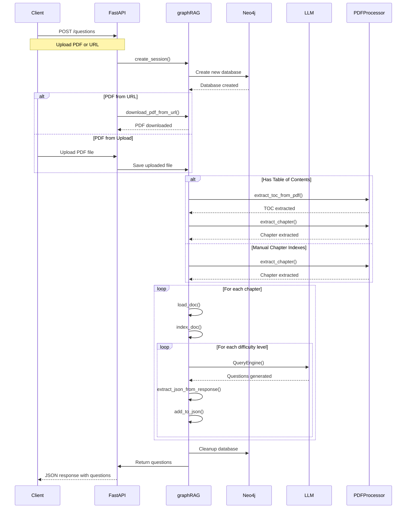

```mermaid
sequenceDiagram
    participant Client
    participant FastAPI
    participant graphRAG
    participant Neo4j
    participant LLM
    participant PDFProcessor

    Client->>FastAPI: POST /questions
    Note over Client,FastAPI: Upload PDF or URL
    
    FastAPI->>graphRAG: create_session()
    graphRAG->>Neo4j: Create new database
    Neo4j-->>graphRAG: Database created
    
    alt PDF from URL
        FastAPI->>graphRAG: download_pdf_from_url()
        graphRAG-->>FastAPI: PDF downloaded
    else PDF from Upload
        Client->>FastAPI: Upload PDF file
        FastAPI->>graphRAG: Save uploaded file
    end
    
    alt Has Table of Contents
        graphRAG->>PDFProcessor: extract_toc_from_pdf()
        PDFProcessor-->>graphRAG: TOC extracted
        graphRAG->>PDFProcessor: extract_chapter()
        PDFProcessor-->>graphRAG: Chapter extracted
    else Manual Chapter Indexes
        graphRAG->>PDFProcessor: extract_chapter()
        PDFProcessor-->>graphRAG: Chapter extracted
    end
    
    loop For each chapter
        graphRAG->>graphRAG: load_doc()
        graphRAG->>graphRAG: index_doc()
        
        loop For each difficulty level
            graphRAG->>LLM: QueryEngine()
            LLM-->>graphRAG: Questions generated
            graphRAG->>graphRAG: extract_json_from_response()
            graphRAG->>graphRAG: add_to_json()
        end
    end
    
    graphRAG->>Neo4j: Cleanup database
    graphRAG->>FastAPI: Return questions
    FastAPI-->>Client: JSON response with questions
``` 